<div align="center">

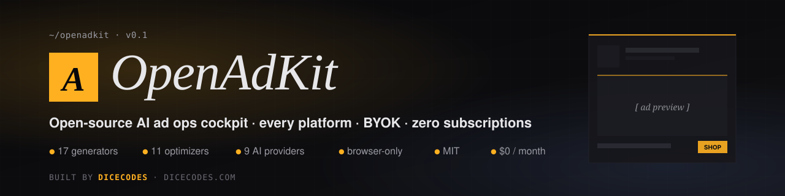

# OpenAdKit — Open Source AI Marketing Tool

<!-- Last updated: 2026-08-01 · keep this fresh on every meaningful README edit; AI citation engines treat it as a freshness signal -->

### The open source AI marketing tool · every ad platform · bring your own AI key · zero subscriptions

*The open-source alternative to Jasper, AdCreative, Anyword, Pencil & Copy.ai · runs in your browser · MIT-licensed · built by [Dicecodes](https://dicecodes.com)*

[](LICENSE)
[](CHANGELOG.md)
[](https://nodejs.org)
[](https://nextjs.org)
[](https://dicecodes.com)
[](#privacy--security)
[](#9-ai-providers-supported)
[](https://github.com/IamRamgarhia/OpenAdKit-Open-Source-AI-Marketing-Tool/stargazers)

**One tool. Every ad platform. Zero subscriptions.**
*Your key · your data · your folder.*

[Use it now — two paths](#use-it-now--two-paths) ·
[Screenshots](#screenshots) ·
[How to use it — step-by-step](#how-to-use-openadkit--step-by-step) ·
[Who's it for](#whos-it-for) ·
[What's inside](#whats-inside) ·
[vs Jasper / AdCreative / Anyword / Copy.ai](#openadkit-vs-jasper-adcreative-anyword-copyai--feature-comparison) ·
[FAQ](#frequently-asked-questions) ·
[Architecture](#architecture) ·
[Star this repo ⭐](https://github.com/IamRamgarhia/OpenAdKit-Open-Source-AI-Marketing-Tool/stargazers)

</div>

---

## What is OpenAdKit?

**OpenAdKit is the open source AI marketing tool** that replaces a **$49–$499/month stack** of paid AI marketing tools (Jasper · AdCreative · Anyword · Pencil · Copy.ai · Marpipe) with **one app that runs entirely in your browser**.

You **bring your own AI key** — free-tier (Groq · Gemini · Cerebras · OpenRouter) or paid (Claude · GPT · Mistral · DeepSeek) — and get every paid-tool feature for **$0/month, forever**.

**18 AI generators · 11 data-driven optimizers · 9 AI providers · multi-client brand brains · vision (image) input on Claude/GPT/Gemini · platform-grouped sidebar · 10-minute launch wizard · multi-client batch mode · auto-update from GitHub.**

> Use it for: writing Google Ads RSA copy, generating Meta / Facebook / Instagram / TikTok / LinkedIn / YouTube / X ads, building Reel hooks, scoring creatives before launch, fixing low-CTR ads, planning campaigns end-to-end, running an agency across many clients, or teaching yourself paid media via the built-in framework trainer (PAS · AIDA · BAB · 4 U's · Schwartz awareness ladder).

```
┌──────────────────────────────────────────────────────────────────────────┐
│                                                                          │
│   Paste a client URL    ─►   OpenAdKit auto-extracts a Brand Brain         │
│                                                                          │
│   ▼                                                                      │
│                                                                          │
│   AI suggests campaigns    ─►   Pick a generator (18 of them)            │
│                                                                          │
│   ▼                                                                      │
│                                                                          │
│   Generate · score · preview · launch                                    │
│                                                                          │
└──────────────────────────────────────────────────────────────────────────┘
```

---

## Screenshots

> Real screenshots of the production app — no mockups. All UI runs in your browser; the only thing we can't show is your own AI provider's output (BYOK — bring your own API key).

### The cockpit — every tool one click away


### 5-step onboarding wizard — pick a provider, paste a key, done

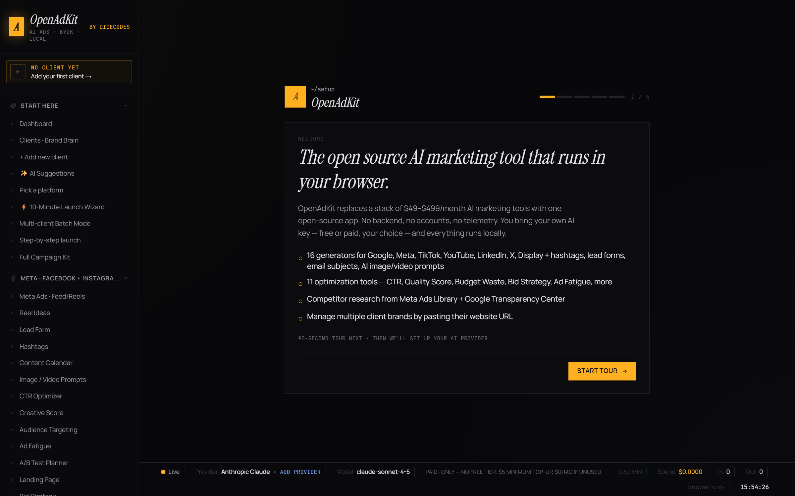

### Settings — switch between 9 AI providers (free + paid) in one click

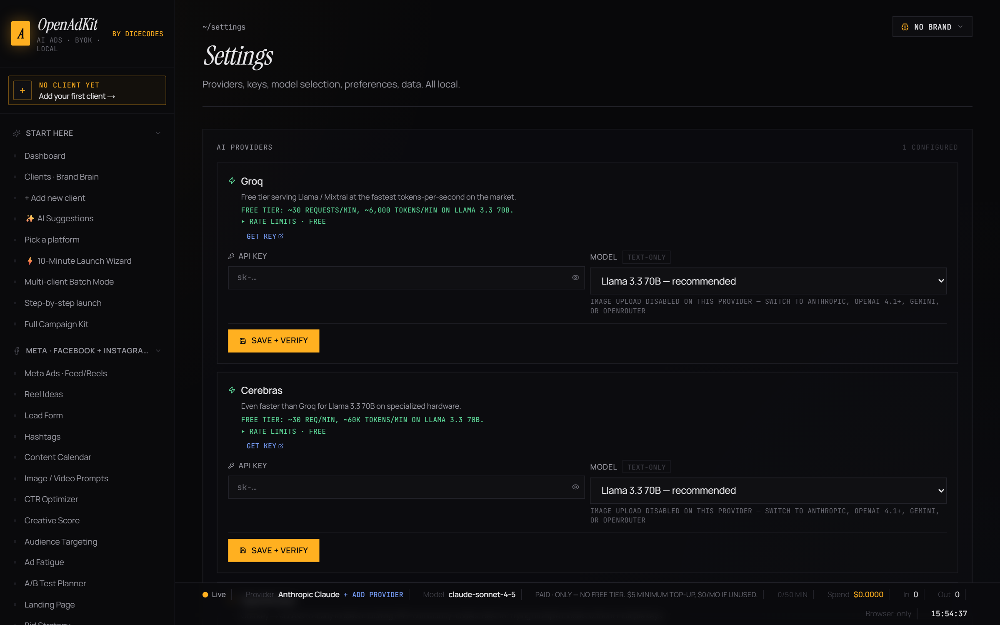

### Meta + Facebook + Instagram ad generator

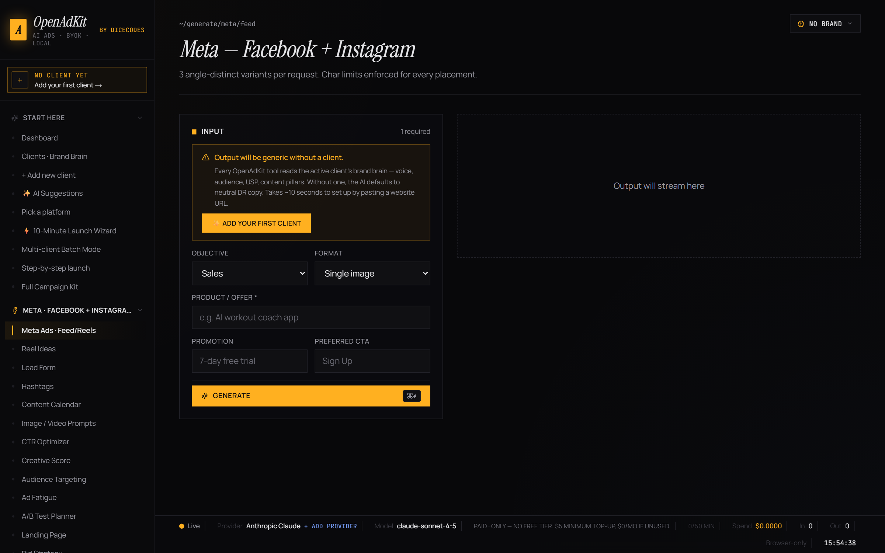

### Creative Score — brutal 5-lever scoring + 3 named fixes

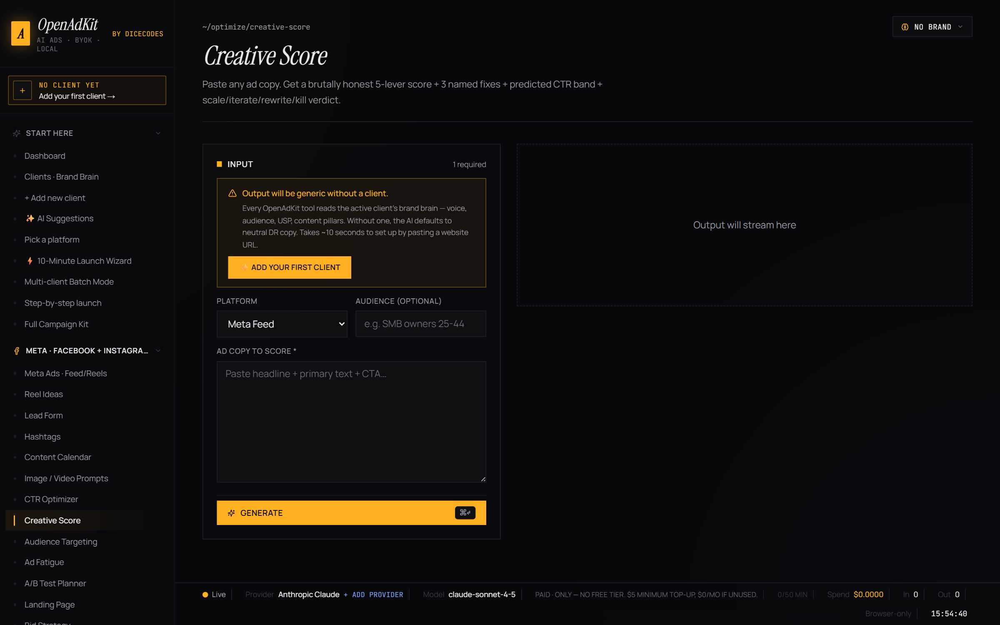

### Competitor research — link straight to Meta, Google, TikTok, LinkedIn ad libraries

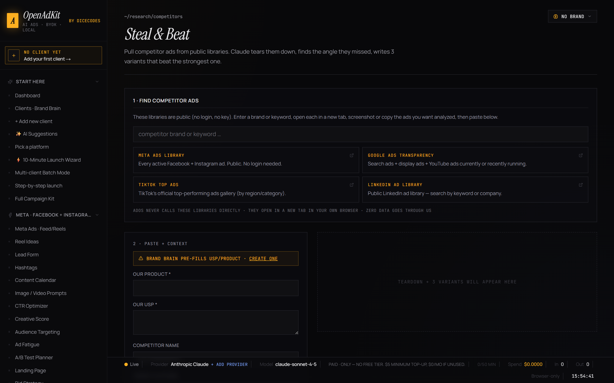

### Compare — side-by-side OpenAdKit vs Jasper / AdCreative / Anyword / Copy.ai

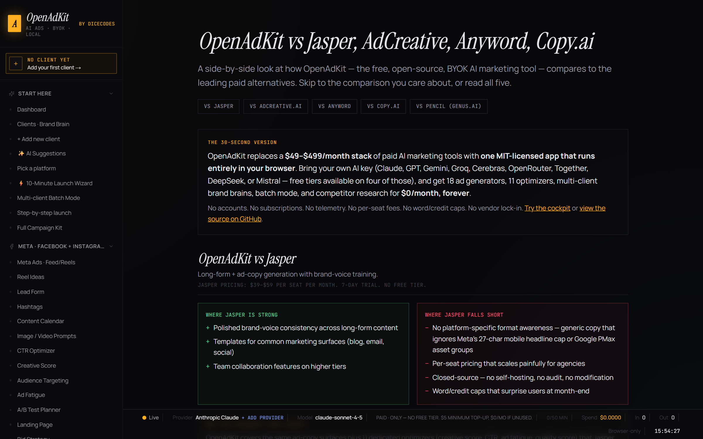

### Built-in benchmarks — real CTR / CPC / CVR / ROAS bands by industry

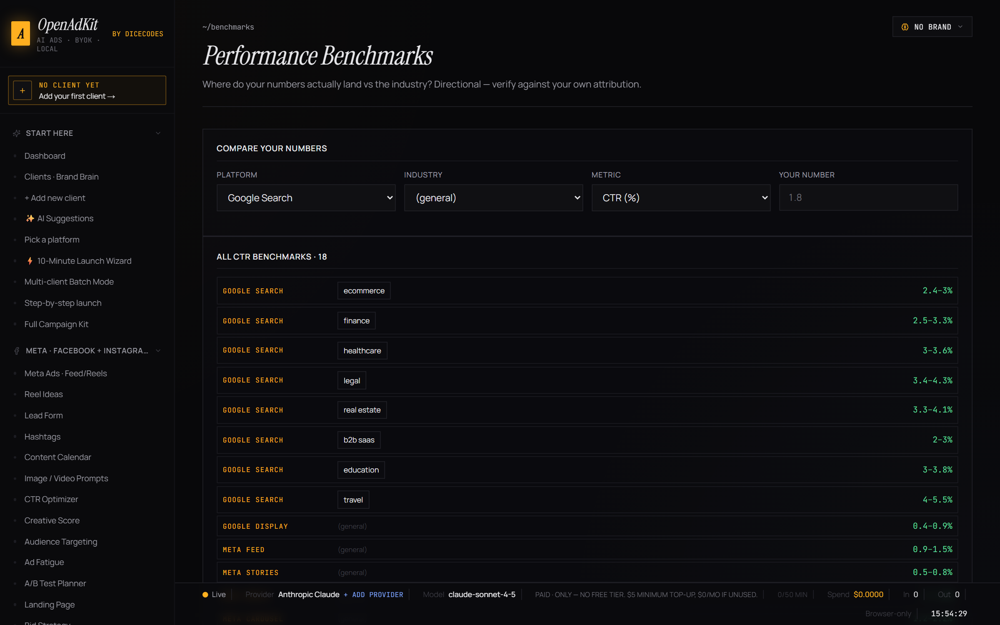

### Platform hub — every ad format, character limit, best practice in one place

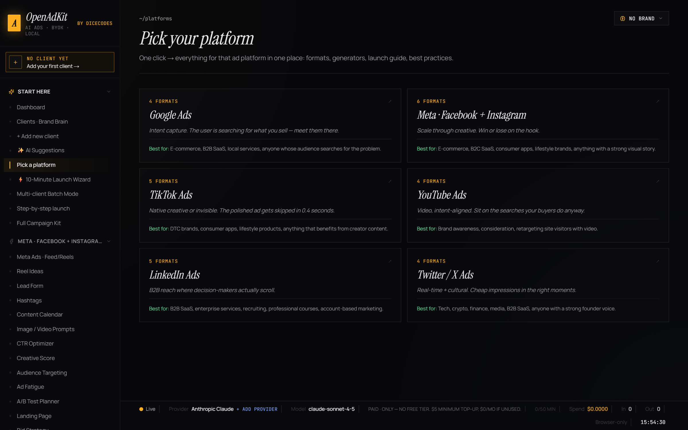

### Platform deep-dive — Meta ad formats explained

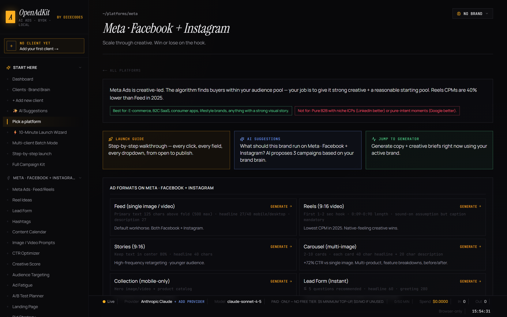

### Learn — ad copywriting framework trainer (PAS, AIDA, BAB, 4 U's, Schwartz awareness ladder)

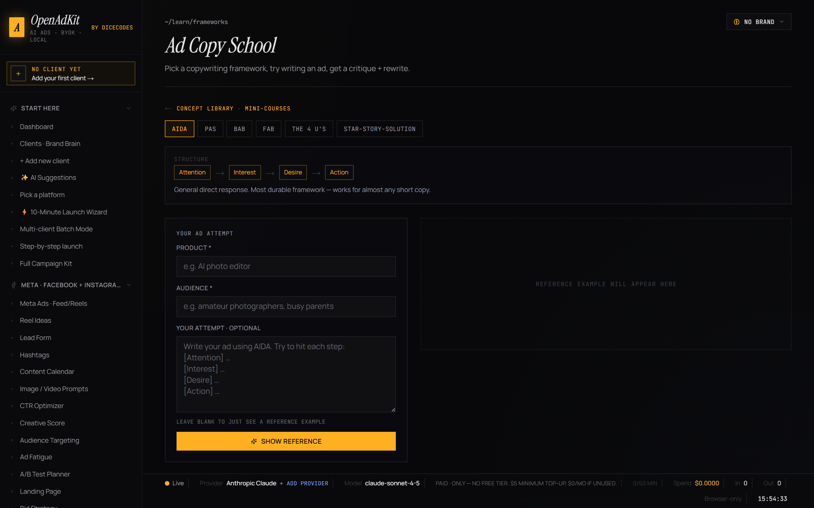

### Launch guide — step-by-step Facebook / Google UI walkthroughs

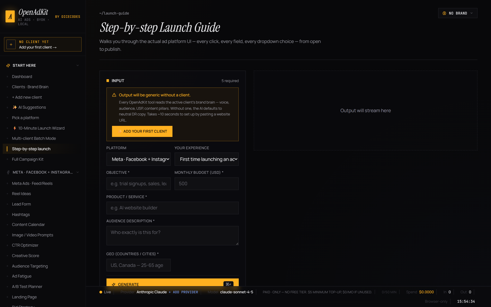

---

## How to use OpenAdKit — step-by-step

> Your first 10 minutes from install to your first AI-generated ad. Follow these five sections in order; total time is about 10 minutes.

### Step 1 · Get OpenAdKit running (30 seconds — 5 minutes)

**Pick one of the two install paths:**

- **Path A — Hosted (recommended for non-developers).** Click the **Deploy with Vercel** or **Deploy to Cloudflare** button in the [Install in 60 seconds](#install-in-60-seconds) section above. Sign in to Vercel/Cloudflare with GitHub, confirm, get your own URL in 30 seconds. Open the URL in your browser. **Done.**
- **Path B — Local install.** Download the repo as a ZIP (green "Code" button → "Download ZIP") and extract it. On Windows double-click **`OpenAdKit.bat`**; on Mac/Linux double-click **`OpenAdKit.command`**. First run installs dependencies (one-time, ~2 minutes), drops a desktop shortcut, and opens the app in your default browser. From the second launch onwards it's a single double-click → browser opens to the app.

**You'll know it worked** when the OpenAdKit setup wizard loads in your browser (see screenshot #1 above).

### Step 2 · Pick an AI provider + paste a key (2 minutes)

This is the **only paid thing** in OpenAdKit, and it can be $0 if you pick a free tier.

1. The setup wizard shows all 9 supported AI providers grouped by **Free** (Groq, Gemini, Cerebras, OpenRouter) and **Paid** (Anthropic Claude, OpenAI GPT, DeepSeek, Mistral, Together AI).
2. **Recommended for first-timers:**
   - **Groq** (free, fastest) — sign up at [console.groq.com](https://console.groq.com), copy your API key (starts with `gsk_…`), paste in OpenAdKit.
   - **Gemini** (free, great quality) — get a key at [aistudio.google.com](https://aistudio.google.com/app/apikey), paste it.
   - **Claude** (best quality, paid) — get a key at [console.anthropic.com](https://console.anthropic.com), starts with `sk-ant-…`.
3. Click **Verify** — OpenAdKit makes one tiny test call to confirm the key works.
4. Pick a model from the dropdown (defaults are sensible). Click **Continue**.

> 💡 You can add multiple provider keys and switch between them anytime in [Settings](#) — useful when you hit a free-tier rate limit, just one-click swap to another provider.

#### Which AI gives the most free credits? (built into the app at `/providers`)

Not sure which provider to pick? OpenAdKit ships a **"Which AI should I use?"** page that compares
every provider's free tier, real cost per generation, and image support side by side — and adds a
**measured** column from your own usage.

| Provider | Free tier | Free requests/day | Card needed | Image input |
|---|---|---|---|---|
| **Groq** | Yes | **14,400** | No | No |
| **OpenRouter** (`:free` models) | Yes | 50 | No | Yes |
| **Cerebras** | Yes | 30/min, no daily cap published | No | No |
| **Google Gemini** | Yes | **~20 per model** | No | Yes |
| Anthropic Claude · OpenAI GPT · DeepSeek · Mistral · Together AI | Paid | — | Yes | Claude/GPT only |

**Best free option for volume: Groq** — 14,400 requests/day with no credit card. **Watch out for
Gemini:** its free limits are counted *per model*, and `gemini-3.6-flash` allows only about **20
requests/day** — the Flash-Lite models are far more generous. These are measured and published
figures, not estimates.

**On "which AI writes better ads": we don't claim to know, and neither should anyone else.** There is
no ground truth for ad copy, so a quality ranking would be invented. What the app does instead is
measure **retry rate** — how often a provider's first reply failed schema validation and had to be
re-asked. That is observable, it doubles your token cost when it happens, and it is computed from
your own generation history.

### Step 3 · Add your first brand (3 minutes)

This is OpenAdKit's killer feature. **You paste one URL, the AI extracts a complete brand profile in 30 seconds.**

1. The setup wizard's last step asks for a **website URL**. Paste the URL of any brand you want to generate ads for — could be your own brand, a client's, or a competitor's you're studying.
2. Click **Extract**. OpenAdKit:
   - Reads the homepage (and 2–3 key subpages like /about, /pricing)
   - Pulls Open Graph data, JSON-LD schema, and social links automatically
   - Asks the AI to fill 30+ brand fields: business name, industry, niche, USP, tone, audience pain points, audience desires, key benefits, brand voice, words to use, words to avoid, competitors, and more
3. Review the populated **Brand Brain**. Edit anything that looks off. Hit **Save**.

> 💡 **Agencies:** repeat Step 3 for each client. Switch the "active client" from the top-bar dropdown anytime; every generator and optimizer automatically uses the active client's Brand Brain to keep the voice consistent.

### Step 4 · Generate your first ad (1 minute)

1. From the dashboard (cockpit), pick a generator. For your first time, try **Meta · Facebook + Instagram Ads** — it's fast, visual, and gives three angle-distinct variants per click.
2. Fill the form:
   - **Objective** — what's the campaign goal (sales, leads, awareness)?
   - **Format** — Feed / Reels / Stories / Carousel
   - **Product / offer** — what are you advertising? (Pre-filled from your Brand Brain.)
   - **Promotion** — any offer like "20% off" or "free trial"
3. Click **Generate**. Watch the AI stream the output in real time.
4. You get **3 variants** anchored to different psychological angles (pain, desire, social proof), each with:
   - Primary text (front-loaded for Meta's 125-char mobile preview)
   - Headline (≤27 chars mobile / ≤40 desktop)
   - Description
   - CTA button suggestion
   - Character count validation per field (the schema retry layer catches AI mistakes)
   - For video formats: hook 0–3s, value 3–15s, CTA 5s with b-roll suggestions and on-screen text

> 💡 Hit ⌘+↵ (Mac) or Ctrl+↵ (Windows) anywhere in the generator to regenerate without touching the mouse.

### Step 5 · Score, optimize, and ship (3–5 minutes)

You've generated copy. Now use the optimizers to make sure it's actually good.

1. Copy one of your variants. Open **Optimize → Creative Score** from the sidebar.
2. Paste the ad copy. Pick the platform you wrote it for. Click **Score**.
3. You get a **brutal 5-lever score** (hook strength, specificity, urgency, brand fit, conversion potential), a **tier verdict** (scale / iterate / rewrite / kill), a **predicted CTR band**, and **3 named fixes** — each fix names the exact phrase to change and the replacement.
4. Apply the fixes. Re-score. Repeat until your tier reads "scale" or "iterate".
5. Optionally run other optimizers before launch:
   - **CTR Optimizer** — lever-by-lever rewrites to lift click-through
   - **Budget Waste** — audit where ad spend is leaking before it does
   - **Audience Targeting** — turn brand brain + budget into a cold/warm/hot tier plan
   - **Quality Score** (Google) — surface relevance issues before they tank your QS
6. Export the campaign as **Markdown** or **JSON** for client handoff via the History page.

> 💡 Use **Launch Guide** in the sidebar for step-by-step screenshots walking you through Facebook Ads Manager or Google Ads from campaign creation to publish — useful if you're new to paid media.

---

### What to try next

- **Research → Steal & Beat** — paste competitor ads from the Meta Ads Library / Google Transparency Center, get a teardown plus 3 beat-their-ad variants.
- **Generate → Content Calendar** — one click for a per-day social calendar with captions, hashtags, and visual briefs across multiple platforms.
- **Generate → Campaign Kit** — one brief becomes message-matched copy across Google + Meta + TikTok + LinkedIn + YouTube + X + email in a single generation.
- **Learn → Frameworks Trainer** — interactive lessons in PAS, AIDA, BAB, the 4 U's, and the Schwartz awareness ladder. Free, ad-free, no signup.

A full step-by-step usage guide also lives at **`/how-to-use`** on the hosted app — same content, hyperlinked navigation, easier to skim on mobile.

---

## Who's it for?

| You are… | OpenAdKit gives you… |
|---|---|
| 🧑‍💻 **A solo founder or indie maker** | Free AI ad copy across Google / Meta / TikTok / LinkedIn / YouTube / X without paying $49–125/mo for Jasper. |
| 🏢 **A marketing agency** | Multi-client brand brains, batch mode (generate the same asset for 5 clients in one parallel run), per-client cost rollup, and Markdown/PDF campaign export for client handoff. |
| 🛒 **An e-commerce store owner** | Performance Max + Shopping ad generators, Reel idea generator with 10 hook formulas, hashtag stacks per platform, content calendar with image/video prompts. |
| 🎓 **A marketing student** | Free practice ground with framework trainer (PAS / AIDA / BAB / FAB / 4 U's), 28 mini-course lessons, 25-concept library, industry benchmarks for CTR/CPC/CVR/ROAS. |
| 💸 **A budget-conscious freelancer** | Bring your own free AI key (Groq, Gemini Flash, Cerebras, OpenRouter free tier) — generate unlimited copy at literally $0 cost. |
| 🔒 **A privacy-conscious team** | Zero backend. No telemetry. No accounts. Your API key + every generation lives in your browser only. Data file portable to another machine in one zip. |
| 🤖 **A power user** | Cmd+K command palette, multi-AI-provider abstraction, vision (screenshot upload) on Claude/OpenAI/Gemini, auto-update from GitHub with safety rules, full keyboard navigation. |

---

## Use it now — two paths

Pick the one that fits you. Both are 100% free, BYOK, and store your work in your browser only — no accounts, no servers we operate, no telemetry.

### Path A · Hosted (zero install, 30 seconds)

Deploy your own private instance to Vercel or Cloudflare in one click. Free tier covers it easily.

[](https://vercel.com/new/clone?repository-url=https%3A%2F%2Fgithub.com%2FIamRamgarhia%2FOpenAdKit-Open-Source-AI-Marketing-Tool)
[](https://deploy.workers.cloudflare.com/?url=https%3A%2F%2Fgithub.com%2FIamRamgarhia%2FOpenAdKit-Open-Source-AI-Marketing-Tool)

What you get: your own URL (`yourname.vercel.app`), nothing to install, works on any device with a browser including mobile + tablet. The app auto-detects hosted mode and uses a built-in `/api/ingest` route (server-side fetch for the URL reader) instead of the local sidecar. **Storage is browser-only IndexedDB** — click *Settings → Export* periodically to back up to a JSON file.

### Path B · Install locally (offline, auto-disk-backup)

You need **Node.js 20+** ([download here](https://nodejs.org/en/download)). That's the only prerequisite — the one-liner below installs everything else.

### Fastest · one line, any OS

**Windows** (PowerShell):
```powershell
iwr -useb https://raw.githubusercontent.com/IamRamgarhia/OpenAdKit-Open-Source-AI-Marketing-Tool/main/scripts/install/install.ps1 | iex
```

**macOS / Linux / WSL**:
```bash
curl -fsSL https://raw.githubusercontent.com/IamRamgarhia/OpenAdKit-Open-Source-AI-Marketing-Tool/main/scripts/install/install.sh | bash
```

That single command: installs Node + git if missing (Windows uses winget), clones the repo into `~/OpenAdKit`, runs `npm install`, asks for a port, then opens the launcher control panel in your browser. Click **▶ Start OpenAdKit** and you're live.

### Manual · Windows · 2 double-clicks
1. **Download** this repo (green "Code" button → "Download ZIP" → extract)
2. **Double-click `OpenAdKit.bat`** — that's it. First run installs Node dependencies, writes a default `.env.local`, drops an `OpenAdKit` shortcut on your Desktop, then opens the launcher. From the second run onwards it's a single click → browser opens to the launcher.

The launcher is a control panel: hit **▶ Start OpenAdKit**, watch the progress bar, then click **↗ Open OpenAdKit** when it's up. From the launcher you can stop, restart, change ports, see update notices, and open three different local URLs.

To shut everything down: close the launcher tab and run `scripts\stop.bat` (or just close the hidden sidecar via Task Manager).

### Manual · Mac / Linux · 2 commands
```bash
git clone https://github.com/IamRamgarhia/OpenAdKit-Open-Source-AI-Marketing-Tool.git openadkit && cd openadkit
bash OpenAdKit.command             # first run installs + creates Desktop shortcut · subsequent runs just launch
# bash scripts/stop.sh           # to force-stop later
```

### Cross-platform · one command (after clone)
```bash
npm install
npm run start:all      # web app + local-sync sidecar together
```

> First launch walks you through a 5-step wizard: welcome → tour → pick AI provider → paste key → optional first brand. No accounts. No env vars. No database.

### Pick your own port
The one-click launcher picks a free pair automatically on first run (high range, so it never collides with the dev servers that crowd 3000–3010); the shell installers default to **3005** / **3006**. Change either from the launcher's **Settings** card any time — no editor needed. Pick anything 1024–65535 (avoid 80 unless you want admin rights).

If you edit `.env.local` by hand, set **both** `ADFORGE_SYNC_PORT` and `NEXT_PUBLIC_ADFORGE_SYNC_PORT` to the same value and rebuild — Next.js only exposes `NEXT_PUBLIC_*` variables to the browser, and that's how the web app finds the sidecar. The launcher keeps the two in sync for you.

### Want a prettier URL?
- **Zero setup:** open `http://openadkit.localhost:3005/` instead of `http://localhost:3005/`. Works in Chrome / Firefox / Safari / Edge today — all modern browsers auto-resolve `*.localhost` to 127.0.0.1.
- **Hosts-file option:** for `http://openadkit.local/` with no port shown, run `scripts/set-domain.bat` (Windows, as admin) or `sudo bash scripts/set-domain.sh` (Mac/Linux). Full guide: [docs/CUSTOM_DOMAIN.md](docs/CUSTOM_DOMAIN.md).

### Where your data lives

**Path A — Hosted:** everything is stored in your browser's IndexedDB. *Settings → Export* writes a JSON backup file you can re-import on another browser / device. Clearing site data wipes everything, so export periodically.

**Path B — Local install:** brand brains, generated ads, campaigns, checklists, performance logs all auto-save to `data/snapshot.json` in the project folder *in addition to* browser IndexedDB. Zip the folder → move to another machine → run `start` again → everything is there.

**What hosted mode sends to your Vercel/Cloudflare server:**
- The URL you typed into the brand-extraction box (so `/api/ingest` can server-side-fetch it past CORS).
- That's it. Your AI key never touches the server — every LLM call goes directly from your browser to the LLM provider. No analytics, no telemetry, no accounts, no logging.

---

## What's inside

### Sidebar is grouped by platform
Pick where you're running ads first ("I'm doing Meta this week"), then see every tool that applies. Cross-platform tools appear under each relevant group so discovery happens by *where* you ship, not by the action verb.

| Platform group | Generators | Optimizers in this group |
|---|---|---|
| **Meta · Facebook + Instagram** | Meta Ads · Reel Ideas · Lead Form · Hashtags · Content Calendar · Image / Video Prompts | CTR Optimizer (Meta-tuned) · Creative Score · Audience Targeting · Ad Fatigue · A/B Test · Landing Page · Bid Strategy |
| **Google · Search + PMax + Shopping** | Google RSA · Performance Max · Shopping · Display Banners | Quality Score Improver · Keyword Builder · Bid Strategy · CTR Optimizer · Audience · Landing Page · A/B Test |
| **TikTok** | TikTok In-Feed · Reel Ideas · Spark Ads · Branded Hashtag Challenge · Hashtags · Content Calendar · Image / Video Prompts | CTR Optimizer · Creative Score · Audience · Ad Fatigue |
| **LinkedIn · B2B** | LinkedIn Sponsored · Lead Form | CTR Optimizer · Audience · Landing Page · A/B Test |
| **YouTube** | YouTube TrueView Scripts · Shorts Ideas · Hashtags · Image / Video Prompts | Creative Score |
| **X · Twitter** | Twitter Ads · Hashtags · Content Calendar | — |
| **Email + Display** | Email Subjects · Display Banners | — |

### Flagship features
- **🤖 Which AI should I use?** (`/providers`) — compare all 9 AI providers on free-tier limits, real cost per generation, and image support, plus a *measured* view of your own usage: generations run, total spend, and how often each provider's output failed validation and had to be re-asked. Ships no invented quality scores.
- **⚡ 10-Minute Launch Wizard** (`/launch/wizard`) — single click → strategy brief + cross-platform ad copy + content calendar + 3-email sequence + launch-day social posts. One Campaign, five chained AI calls, streaming live.
- **Multi-Client Batch Mode** (`/batch`) — pick N clients → generate the same asset (Content Calendar / Hashtags / Reel Ideas / Campaign Kit) for all in parallel. Each output uses that client's own brand brain so voice is preserved per-client.
- **Reel Idea Generator** (`/generate/reel-ideas`) — 10 proven hook formulas rotated across a batch (POV / Contradiction / Listicle / Number-Promise / Pattern-Interrupt / Before-After / Story / Demo / Controversy / Insider) with platform-native rules baked in for IG Reels / TikTok / Shorts / FB Reels.
- **Competitor Reel Teardown** (`/research/reel-teardown`) — paste a competitor's captions → AI maps hook formulas, content pillars, format mix, weakness map → writes 5 "beat-their-reel" scripts citing the specific reels they respond to.
- **Data-first optimizers** — every optimizer (CTR · Quality Score · Audience · Landing Page · Keywords · Bid Strategy · Ad Fatigue) requires real Google Ads / Meta / TikTok numbers, computes derived metrics, and cites specific values in its recommendations. Optional dashboard-screenshot upload on vision-capable providers (Claude / OpenAI 4.1+ / Gemini).

### Universal tools (used across platforms)
**Full Campaign Kit** · **Hashtags (any language)** · **Email Subjects** · **Lead Forms** · **AI Image/Video Prompts** · **Social Content Calendar** · **Steal & Beat** competitor ad teardown · **Compare 2 Ads** · **Budget Waste Analyzer** · **Budget Planner** · **A/B Test Planner**

### Multi-client management
- Add a client by **pasting a website URL** — OpenAdKit auto-extracts the Brand Brain (tone, audience, USP, VOC, words to use/avoid) using Jina Reader + your chosen LLM
- 10 **industry templates** for instant brand creation (local restaurant, B2B SaaS, e-commerce fashion, agency, etc.)
- One-click switcher in the top bar
- History + checklists scope to active client automatically

### Competitor intelligence
- **Steal & Beat** — paste competitor ads from Meta Ads Library / Google Transparency Center / TikTok Top Ads / LinkedIn Ad Library. AI tears them down + writes 3 variants that beat the strongest one.
- **Compare 2 ads** — head-to-head AI teardown · picks the winner · proposes a hybrid

### Step-by-step launch guides
Pick a platform + experience level + budget — OpenAdKit walks you through **every click, every field, every dropdown** in Meta Ads Manager / Google Ads / TikTok Ads Manager / LinkedIn Campaign Manager. For non-technical users who've never launched an ad before.

### Routines + learning
- **Daily / Weekly / Monthly** checklists with streak counters and custom items
- **28 mini-course lessons** across Google · Meta · TikTok tracks
- **Interactive Ad Copy School** — type → AI critiques → you rewrite (AIDA, PAS, BAB, FAB, 4 U's)
- **25-concept library** + on-demand AI explainer
- **Industry benchmarks** for CTR/CPC/CVR/ROAS across 8 verticals

### Performance feedback loop
Log impressions / clicks / conversions / spend / revenue per ad → OpenAdKit computes CTR / CPA / ROAS → surfaces **winning angles per brand** in future Suggested Campaigns.

### Ad mockups · what they'll look like
Every Google / Meta / TikTok generation includes a **live realistic mockup** — Feed cards, Reels overlays, Search SERP previews, For-You-page mockups. No more guessing the visual.

---

## 9 AI providers supported

| Tier | Provider | Free? | Notes |
|---|---|:-:|---|
| **Free** | **Groq** | ✅ | ~30 req/min · fastest tokens/sec |
| **Free** | **Cerebras** | ✅ | ~30 req/min · even faster than Groq |
| **Freemium** | **Google Gemini** | ✅ | Generous free tier on Flash · paid Pro |
| **Freemium** | **OpenRouter** | ✅ | Free community models tagged `:free` |
| **Freemium** | **Together AI** | partial | Some free models · mostly cheap paid |
| **Paid** | **Anthropic Claude** | ❌ | Strongest for long-context reasoning |
| **Paid** | **OpenAI GPT** | ❌ | Best at structured JSON |
| **Paid** | **DeepSeek** | ❌ | Cheapest serious model |
| **Paid** | **Mistral** | ❌ | Multilingual + JSON |

Pick during onboarding · switch any time in Settings · one app, every API.

---

## OpenAdKit vs Jasper, AdCreative, Anyword, Copy.ai — Feature Comparison

> Looking for one specifically? Jump to:
> [OpenAdKit vs Jasper](#openadkit-vs-jasper) ·
> [OpenAdKit vs AdCreative](#openadkit-vs-adcreativeai) ·
> [OpenAdKit vs Anyword](#openadkit-vs-anyword) ·
> [OpenAdKit vs Copy.ai](#openadkit-vs-copyai) ·
> [OpenAdKit vs Pencil](#openadkit-vs-pencil--genusai)
>
> Or read the full side-by-side at [openadkit.dicecodes.com/alternatives](https://openadkit.dicecodes.com/alternatives).

### Full feature matrix

| Feature | Jasper $49+ | AdCreative $39+ | Anyword $49+ | Pencil $119+ | **OpenAdKit · free** |
|---|:-:|:-:|:-:|:-:|:-:|
| Visual ad mockups | ❌ | ✅ | ❌ | ✅ | ✅ |
| Multi-platform copy | ✅ | partial | ✅ | Meta-only | ✅ (18 generators) |
| Brand voice memory | ✅ | ❌ | partial | partial | ✅ (per-client) |
| Predictive creative scoring | ❌ | ✅ | ✅ | ✅ | ✅ |
| Competitor teardown | ❌ | ✅ | ❌ | ✅ | ✅ (4 libraries) |
| Compare A/B before launch | ❌ | ❌ | ✅ | ❌ | ✅ |
| Industry templates | ✅ | ✅ | ✅ | ❌ | ✅ (10) |
| Performance feedback loop | ❌ | ❌ | ❌ | ✅ | ✅ |
| Campaign grouping | ✅ | ✅ | ✅ | ✅ | ✅ |
| Step-by-step UI launch guides | ❌ | ❌ | ❌ | ❌ | ✅ |
| Decision tree planner | ❌ | ❌ | ❌ | ❌ | ✅ |
| Hashtags in any language | partial | ❌ | ❌ | ❌ | ✅ |
| Content calendar with AI tool links | ❌ | partial | ❌ | ❌ | ✅ |
| Mini-courses + framework trainer | ❌ | ❌ | ❌ | ❌ | ✅ (28 lessons) |
| Cmd+K palette · power-user nav | ❌ | ❌ | ❌ | ❌ | ✅ |
| 9 AI providers · BYOK · free+paid | 1 | 1 | 1 | 1 | ✅ |
| Browser-only · MIT · self-host | ❌ | ❌ | ❌ | ❌ | ✅ |
| Folder-portable data | ❌ | ❌ | ❌ | ❌ | ✅ |
| **Monthly cost** | **$49–125** | **$39–299** | **$49–999** | **$119–999** | **$0** |

### OpenAdKit vs Jasper

Jasper ($39–59/seat/mo) is the polished long-form + ad-copy generator with brand-voice training. It's strong on consistency across blog/email/social, but **lacks platform-specific format enforcement** — generic copy ignores Meta's 27-char mobile-headline cap, Google PMax asset groups, and TikTok Spark Ad mechanics. Per-seat pricing scales painfully for agencies. **OpenAdKit covers the same ad-copy surfaces plus 11 dedicated optimizers** (creative score, CTR, ad fatigue, quality score) that Jasper doesn't have, and BYOK across 9 providers means you match Jasper's Claude/GPT-4 quality at $0 marginal cost.

### OpenAdKit vs AdCreative.ai

AdCreative ($39–249+/mo) is best for **AI-generated visual ad creatives** (banners, video) with a 'conversion probability' score — capabilities OpenAdKit does NOT have in-app. Their scoring is opaque (no audit of how it's computed) and they lock you into their LLM choices. **OpenAdKit beats AdCreative on copy generation breadth** (18 generators vs ~6 in their copy module) and optimizer count. For visuals, OpenAdKit returns ready-to-paste prompts for Midjourney / DALL-E / Runway / Pika plus a directory of free + paid tools — you keep choice and avoid lock-in.

### OpenAdKit vs Anyword

Anyword ($49–499/seat/mo) is known for **per-variant predictive scoring** correlated with historical performance + brand-voice training. Steep tier gap — enterprise features paywalled at $499/mo. No platform-specific format generators (no PMax, no Spark Ads, no Branded Hashtag Challenge). **OpenAdKit's Creative Score optimizer** covers similar scoring ground (5-lever score + named fixes + predicted CTR band) without per-seat fees. Anyword's brand-voice training maps to OpenAdKit's **Brand Brain** (auto-extracted from any URL — no manual setup).

### OpenAdKit vs Copy.ai

Copy.ai (Free 2k words/mo, Pro $49/mo, Team $249/mo) offers **multi-step GTM workflows** and sales-prospecting agents. The free tier burns through in a single content-calendar generation. Workflows paywalled at $249/mo. **OpenAdKit has no word/credit caps** because you pay your LLM provider directly (free tiers on Groq, Gemini, Cerebras, OpenRouter). The Launch Wizard handles the same multi-step orchestration Copy.ai charges $249/mo for, and the 18 generators each include platform-specific format enforcement Copy.ai's generic templates don't.

### OpenAdKit vs Pencil / Genus.ai

Pencil (~$119+/mo, enterprise) does **AI ad creative generation with performance prediction** and feedback loops from real ad-platform data. They pivoted to enterprise — out of reach for solo / SMB marketers. **OpenAdKit is the right tool for that abandoned segment**: same copy + optimizer breadth, $0 instead of $119+/mo, MIT-licensed so your work and brand data stay yours forever.

---

## Architecture

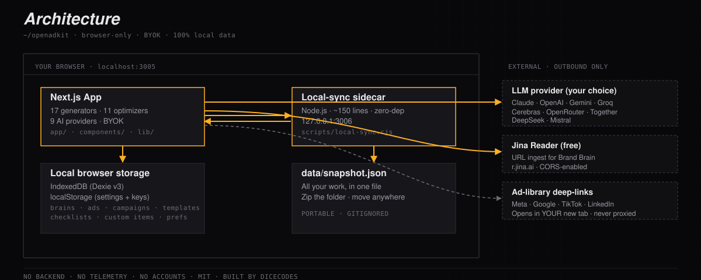

<details>
<summary>Text version (for screen readers)</summary>

```
┌─────────────────────────────────────────────────────────────────────┐
│                         YOUR BROWSER                                │
│                                                                     │
│   Next.js App  ──►  Jina Reader (URL ingest)                        │
│   (port 3005)  ──►  Your chosen LLM provider directly               │
│                     (api.anthropic.com / openai.com / generative…)  │
│                                                                     │
│   IndexedDB  ◄──── auto-sync ────►  Local-sync sidecar              │
│   localStorage                       (port 3006, Node, zero-dep)    │
│                                              │                      │
│                                              ▼                      │
│                                       data/snapshot.json            │
│                                       (portable!)                   │
└─────────────────────────────────────────────────────────────────────┘
```

</details>

**Outbound calls from the running app**:
1. The LLM provider you configured · for every generation
2. Jina Reader (`r.jina.ai`) · only when ingesting a brand URL
3. AllOrigins (`api.allorigins.win`) · only as a fallback if Jina is rate-limited
4. The competitor ad libraries (`facebook.com/ads/library`, `adstransparency.google.com`, `ads.tiktok.com`, `linkedin.com/ad-library`) · only when YOU click "Open" — they open in YOUR new tab, never proxied through us.

**No backend OpenAdKit owns. No telemetry. No analytics. No accounts.**

---

## Privacy & security

- **No backend.** Your data never leaves your browser.
- **No telemetry.** Zero tracking, zero analytics calls.
- **BYOK.** API keys live in your browser's `localStorage` only.
- **Direct calls.** Each LLM provider receives the request directly from your browser — no proxy.
- **Folder-portable.** All non-key data syncs to `data/snapshot.json`. Keys are excluded by default (toggle in Settings → Preferences).
- **Soft-delete + undo.** Accidental deletes get a 7-second undo toast.
- **Wipe & export.** Settings includes full export (JSON/CSV/Markdown) and "wipe all local data."

> ⚠️ Because keys are in `localStorage`, treat OpenAdKit like your password manager: only install on devices you trust, don't paste keys on shared machines.

See [SECURITY.md](SECURITY.md) for the threat model + responsible-disclosure flow.

---

## Project layout

```
openadkit/
├── app/                         Next.js App Router (56 routes)
│   ├── generate/*               18 ad generators (Reel Ideas, Spark Ads, BHC, etc.)
│   ├── optimize/*               11 data-first optimization tools
│   ├── research/*               Steal & Beat · Compare ads · Reel Teardown
│   ├── launch/wizard/           10-minute Launch Wizard
│   ├── batch/                   Multi-client batch generation
│   ├── platforms/[platform]/    Per-platform hubs
│   ├── checklist/*              Daily / Weekly / Monthly routines
│   ├── learn/*                  Concepts · mini-courses · framework trainer
│   ├── suggestions/             AI-suggested campaigns per brand
│   ├── launch-guide/            Step-by-step UI walkthrough
│   ├── campaigns/               Group ads · status lifecycle
│   ├── brand/                   Multi-client Brand Brains
│   ├── benchmarks/              Industry CTR/CPC/CVR/ROAS
│   ├── strategy/                What to run · decision tree
│   ├── about/                   Built by Dicecodes
│   └── settings/                Provider keys · prefs · wipe
│
├── components/
│   ├── AdMockup.tsx             Meta/Google/TikTok/YouTube live previews
│   ├── CommandPalette.tsx       Cmd+K fuzzy nav
│   ├── UndoToast.tsx            Global 7-second undo
│   ├── PerformanceDialog.tsx    Log impressions/CTR/CPA/ROAS
│   └── …                        Shared UI primitives
│
├── lib/
│   ├── providers/               9-provider abstraction
│   ├── prompts/                 30+ AI prompt templates
│   ├── storage.ts               Dexie/IndexedDB schema v3
│   ├── settings.ts              localStorage layer + migration
│   ├── local-sync.ts            Folder-sync client
│   ├── url-ingest.ts            Jina + AllOrigins fallback
│   ├── benchmarks.ts            Industry data
│   ├── platform-hubs.ts         Per-platform reference
│   ├── industry-templates.ts    10 quick-start templates
│   └── courses.ts               28 mini-course lessons
│
├── scripts/
│   ├── local-sync.cjs           ~150-line Node sidecar (folder persistence)
│   ├── run-all.cjs              Cross-platform launcher
│   └── refresh_knowledge.py     Optional maintainer tool
│
├── data/                        Your snapshot lives here (gitignored)
├── OpenAdKit.bat / OpenAdKit.command  Click-to-launch (Desktop shortcut points here)
├── scripts/install/install.ps1    One-line online bootstrap (Windows · PowerShell · iwr | iex)
├── scripts/install/install.sh     One-line online bootstrap (Mac / Linux / WSL · curl | bash)
├── scripts/start.bat / start.sh    Manual sidecar runner (advanced)
├── scripts/stop.bat / stop.sh      Force shutdown
└── package.json
```

---

## Tech stack

- **Next.js 14** (App Router, fully static-prerendered)
- **TypeScript** strict
- **Tailwind CSS** + hand-rolled "Trading-Terminal × Editorial" design system
- **Dexie** for IndexedDB · **localStorage** for settings
- **Manrope + JetBrains Mono + Instrument Serif** (self-hosted via `next/font`)
- **No state-management framework** — `useState` + storage helpers
- **No backend** — everything runs in your browser
- **No analytics** — full stop
- **Zero npm dependencies** in the local-sync sidecar (Node stdlib only)

Production build: 56 statically prerendered routes · 87 KB shared JS · 130-160 KB first-load JS per route.

---

## Start / Stop reference

| Action | Windows | Mac / Linux | Cross-platform |
|---|---|---|---|
| Install + Launch | double-click `OpenAdKit.bat` — first run installs, every run after just launches | `bash OpenAdKit.command` (same: first run sets up, after that it just launches) | `npm install && npm run start:all` |
| Force-stop everything | `scripts\stop.bat` | `bash scripts/stop.sh` | Ctrl+C in the sidecar window |
| Manual sidecar (visible log) | `scripts\start.bat` | `bash scripts/start.sh` | `npm run start:all` |
| Web only | `npm run dev` | `npm run dev` | `npm run dev` |
| Sync sidecar only | `npm run sync` | `npm run sync` | `npm run sync` |
| Typecheck | `npm run typecheck` | — | — |
| Production build | `npm run build` | — | — |

Ports: auto-resolved at launch and written to `.env.local` (installers default to web app **3005** · sync sidecar **3006**). Both localhost-only.

---

## Troubleshooting

Most problems come down to one of four things: a port already in use, Node missing or too old, Windows Defender blocking a script, or `.env.local` pointing at the wrong port. The launcher's **⚠ Report a problem on GitHub** button auto-fills an issue with your exact Node/OS/port state — use it if any of these don't help.

### Sidecar won't start

**Symptom:** Double-clicking `OpenAdKit` does nothing, or the cmd window flashes and disappears.

1. Open a terminal in the install folder and run `node --version`. If it reports anything below **v20.0.0** or "command not found," install Node 20+ from <https://nodejs.org/en/download>.
2. Run `scripts\start.bat` (Windows) or `bash scripts/start.sh` (Mac/Linux) directly — the window stays open and prints the real error.
3. If you see `Input Error: There is no script engine for file extension ".vbs"`, your Windows Script Host is disabled. The current `OpenAdKit.bat` uses PowerShell instead — make sure you have the latest version from this repo.

### Port already in use

**Symptom:** Sidecar starts but `/status` returns `web: starting` forever, or the launcher says "EADDRINUSE 3005."

- The web app defaults to port 3005, sidecar to 3006. Open the launcher → **Settings** → change to anything 1024–65535. Save, then Stop + Start.
- On Windows, find who owns the port: `netstat -ano | findstr :3005` then `taskkill /PID <pid> /F`.
- On Mac/Linux: `lsof -iTCP:3005 -sTCP:LISTEN`.

### Port mismatch between `.env.local` and the launcher

**Symptom:** Launcher's "Open OpenAdKit" button points at the wrong port.

- Open `.env.local` in the install folder. It should have three lines: `PORT=`, `ADFORGE_SYNC_PORT=`, and `NEXT_PUBLIC_ADFORGE_SYNC_PORT=` (the last two **must match** — that's how the browser finds the sidecar).
- If all of them match what the launcher shows, you're fine. If they don't, save the correct values in `.env.local` and force-stop everything (`scripts\stop.bat` or `bash scripts/stop.sh`), then relaunch — the launcher rewrites all three and rebuilds.
- **Symptom that this is wrong:** brand-by-URL always falls back to Jina/AllOrigins, and folder sync never writes `snapshot.json`. Both features talk to the sidecar, so a mismatched public port disables them silently.

### Windows Defender / SmartScreen warning

**Symptom:** "Windows protected your PC" dialog when running `OpenAdKit.bat`.

- Click **More info → Run anyway**. The warning appears for any unsigned script downloaded from the internet — OpenAdKit is open source and reviewable.
- For zero warnings: clone the repo with `git clone` instead of downloading the ZIP. Files created locally don't carry the "mark of the web."

### Auto-update from GitHub

The launcher checks GitHub once per page load for new commits on `main` and surfaces an **⬆ Update available** banner when there's something newer than your local HEAD. Click **Update now** to apply.

**What it does** (each step's failure stops the pipeline and surfaces the error — your tree is never force-reset):

1. Stop the web app
2. `git fetch origin main`
3. `git pull --ff-only origin main` *(no merges, no rebases — refuses on non-fast-forward to protect local work)*
4. `npm install --no-audit --no-fund` *(in case package-lock.json changed)*
5. Recursively delete `.next/` build cache
6. Restart the web app on the new code

**Rules the updater follows:**

| Rule | What it does |
|---|---|
| **Branch lock** | Only runs when local branch is `main`. If you're on a feature branch, the banner stays hidden — you're developing, we don't second-guess. |
| **Dirty-tree lock** | Pre-flight `git status --porcelain`. Any uncommitted change → refuse with a clear "Commit or stash first" message. |
| **No auto-apply** | The check is automatic, the apply is always manual via the button + confirm dialog. |
| **No destructive ops** | No `git reset --hard`, no `--force`, no `--no-verify`. If something's wrong, your state is preserved. |
| **Single in-flight** | Only one update job at a time. The button locks until the current one finishes. |
| **Observable** | Live log streams during apply. After success: "Reload launcher" button (manual — never auto-reloads). |
| **Source of truth** | GitHub REST API at `/repos/IamRamgarhia/OpenAdKit-Open-Source-AI-Marketing-Tool/commits/main`. No auth needed (public repo). |
| **Data safe** | Your `data/snapshot.json` is never touched by the update. Brand brains, generated ads, campaigns, and history all survive. |

**If the banner says "Working tree has uncommitted changes":** you've modified files locally. Either `git add . && git commit -m "my changes"` or `git stash`, then click **Update now** again.

**If the banner says "Couldn't reach GitHub":** check your internet connection. The check happens once per launcher page load, so reload to retry.

### Page loads as raw unstyled HTML (no CSS / no layout)

**Symptom:** Sidebar items show as a vertical list of plain text links, no orange branding, no dark background.

This is a stale `.next/` build-cache problem — usually caused by running `npm run build` while `next dev` is also running, which clobbers chunk files the dev server still references.

**Fastest fix:**
1. Open the launcher (http://127.0.0.1:3006/)
2. Scroll to the **🧹 Clean rebuild** button in the trouble row
3. Click it → confirms → wipes `.next/`, restarts the web app on a clean cache

**Manual fix** (no launcher available): delete the `.next/` folder in the install directory and re-run `OpenAdKit.bat` (or `bash OpenAdKit.command` on Mac/Linux).

### Web app stays on "Starting…" past 30 seconds

**Symptom:** Launcher shows "Starting OpenAdKit…" with progress bar that never completes.

- First boot compiles 56 routes; this can take 15-30 seconds on slow disks. Wait a full minute.
- If it's still stuck, click **⚠ Report a problem** in the launcher — the GitHub issue will include `web_last_log` which usually shows the exact compile error.
- Workaround: stop the launcher, delete `.next/` in the install folder, restart.

### Browser says "site can't be reached"

**Symptom:** Clicking "Open OpenAdKit" shows `ERR_CONNECTION_REFUSED`.

- The web app isn't running. Go back to the launcher and check the status dot — orange means starting, gray means stopped. Click **Start**.
- If the dot is green but the page still fails, your browser may have cached an old port. Try `http://127.0.0.1:<port>/` directly with the port shown in the launcher.

### Where do I find the logs?

- **Launcher (sidecar) logs:** the launcher page shows the last 3 lines of the Next.js output in the gray log box. For full logs, run `scripts\start.bat` / `bash scripts/start.sh` in a visible window instead of `OpenAdKit.bat`.
- **Web app errors in the browser:** open DevTools (F12) → Console.
- **Data file:** `data/snapshot.json` in the install folder is everything OpenAdKit has saved.

### Reporting a bug

Click **⚠ Report a problem on GitHub** in the launcher — it pre-fills [github.com/IamRamgarhia/OpenAdKit-Open-Source-AI-Marketing-Tool/issues/new](https://github.com/IamRamgarhia/OpenAdKit-Open-Source-AI-Marketing-Tool/issues/new) with your platform, Node version, port config, and recent log lines. Add what you were trying to do and submit.

---

## Frequently Asked Questions

### Is OpenAdKit really free?
Yes. **Forever, no asterisk.** Released under the **MIT license**. We make money from custom builds at [Dicecodes](https://dicecodes.com) — not from this tool. You only pay your chosen AI provider, and several of them (Groq, Gemini Flash, Cerebras, OpenRouter `:free` models) cost **$0/month** for typical OpenAdKit usage.

### Is OpenAdKit a real Jasper / AdCreative / Copy.ai alternative?
For ad-copy generation across Google, Meta, TikTok, LinkedIn, YouTube, and X — yes. OpenAdKit has 18 generators covering every major ad format, plus 11 data-driven optimizers, multi-client brand brains, competitor teardowns, content calendars, and a 10-minute launch wizard. The one thing it doesn't do is *image generation* — for that, OpenAdKit writes prompts for Midjourney / Runway / DALL-E / Pika instead of running its own image model.

### Where does my data go?
**Nowhere except your own browser.** All your brand brains, generated ads, campaigns, and history live in your browser's IndexedDB. The folder-sync sidecar mirrors everything to `data/snapshot.json` *in the project directory on your own machine*. No analytics, no telemetry, no accounts, no cloud sync.

### What about my AI API key?
Stored in your browser's `localStorage`, same as 1Password's browser extension stores your session. Every LLM call goes **directly from your browser to the provider** (api.anthropic.com, api.openai.com, etc.) — never proxied through any OpenAdKit server (we don't run one). Treat your install like a password manager: only set it up on devices you trust.

### Which AI provider should I pick if I want it free?
**Groq** for speed, **Gemini 3.6 Flash** for free-tier generosity, or **OpenRouter** for free community models (`google/gemma-4-31b-it:free`, `nvidia/nemotron-3-super-120b-a12b:free`). All four are first-class. Add multiple keys in Settings and switch between them per project.

### Can I run OpenAdKit on a server / for my whole team?
Out of the box it's designed for one person on one machine. You *can* expose it on a LAN by changing the bind from `127.0.0.1` to `0.0.0.0` in `scripts/local-sync.cjs`, but it has no auth layer — anyone on the network would have full access including your API keys. For team use, fork it and add your own auth, or wait for a multi-user fork (or [hire us](mailto:Contact@dicecodes.com) to build one).

### How do I move OpenAdKit to another machine?
Zip the entire folder → copy to the new machine → run `OpenAdKit.bat` / `OpenAdKit.command`. Every brand brain, ad, campaign, checklist, and performance log comes with you in `data/snapshot.json`. API keys are excluded by default (re-paste them on the new machine for safety).

### Does it work offline?
The Service Worker caches the app shell + all 56 routes, so the UI loads offline. AI generation needs internet (every LLM provider is online-only). URL ingest (Jina Reader) and Google search (Jina Search) also need internet. Everything else — viewing history, editing brands, browsing campaigns — works fully offline.

### Can the AI read screenshots of my Google Ads dashboard?
**Yes**, on vision-capable providers (Claude, OpenAI GPT-4.1+, Gemini). Drop a screenshot into CTR Optimizer / Quality Score / Audience / Landing Page / Keywords / Bid Strategy / Ad Fatigue and the AI extracts metrics + recommendations directly from the image. If your active provider is text-only (Groq, DeepSeek, Mistral, Cerebras, Together), OpenAdKit auto-falls-back to a vision-capable provider you've configured a key for, just for that one generation.

### How is OpenAdKit different from ChatGPT or Claude itself?
ChatGPT/Claude are general models — they'll write ad copy if you prompt them, but you do all the framework selection, character-limit validation, platform-specific rules, and JSON structuring yourself. OpenAdKit wraps the model with **30+ task-specific prompts** that bake in Schwartz's awareness ladder, Google RSA character limits, Meta primary-text rules, TikTok hook formulas, 4 U's headline scoring, and 20 years of direct-response copywriting patterns. You paste a URL + a goal; OpenAdKit writes you a launch-ready campaign.

### Is the code production-quality?
Production build is **56 static routes · 87 KB shared JS · 130-160 KB first-load JS per route**. Strict TypeScript across the entire codebase. Vitest unit tests for the highest-risk pure functions (smart-fill, brand-brain normalization, framework stack, next-steps routing, LLM helpers — 43 tests total). CI runs typecheck + tests + production build + lint on Node 18 / 20 / 22 for every PR.

### How do I contribute?
See [CONTRIBUTING.md](CONTRIBUTING.md). Most generators are a single prompt file + a single page that imports `GeneratorShell`. A typical new-generator PR is 30-60 lines of code and 30-60 minutes of work.

### License?
**MIT.** Use it commercially. Fork it. White-label it. The only thing we ask: don't claim you wrote it.

---

## Contributing

See [CONTRIBUTING.md](CONTRIBUTING.md). Most contributions are a single prompt + a single page using the shared `GeneratorShell` framework — aim for 10-minute PRs.

Pattern grounding: OpenAdKit prompts borrow patterns (with attribution) from open-source skill repos. See [NOTICE.md](NOTICE.md) for the full source list.

---

## About

OpenAdKit is built by **[Dicecodes](https://dicecodes.com)** — a digital studio combining creative design with advanced technology for measurable business growth.

We make money from custom builds, not from this tool. **OpenAdKit will always be free.**

Need a private fork, a white-labeled agency edition, or something we haven't built? **[Get in touch →](https://dicecodes.com)** · 📧 [Contact@dicecodes.com](mailto:Contact@dicecodes.com) · 💬 [WhatsApp +91 98884 04991](https://wa.me/919888404991)

---

## License

MIT. See [LICENSE](LICENSE).

<sub>*Built by Dicecodes · Open source forever · No backend · No telemetry · Your key, your data, your folder.*</sub>
